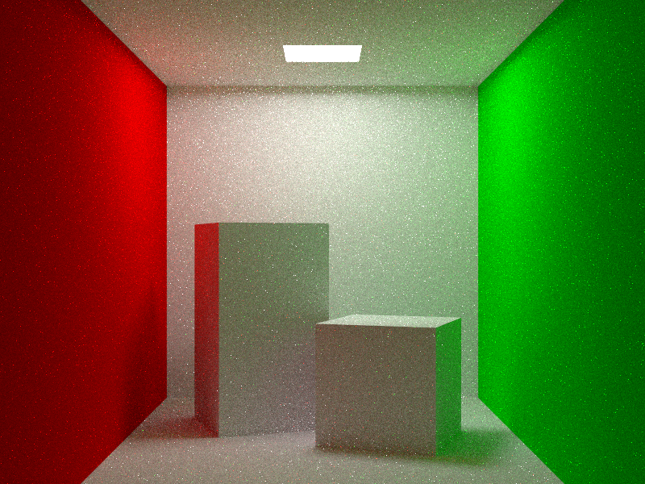
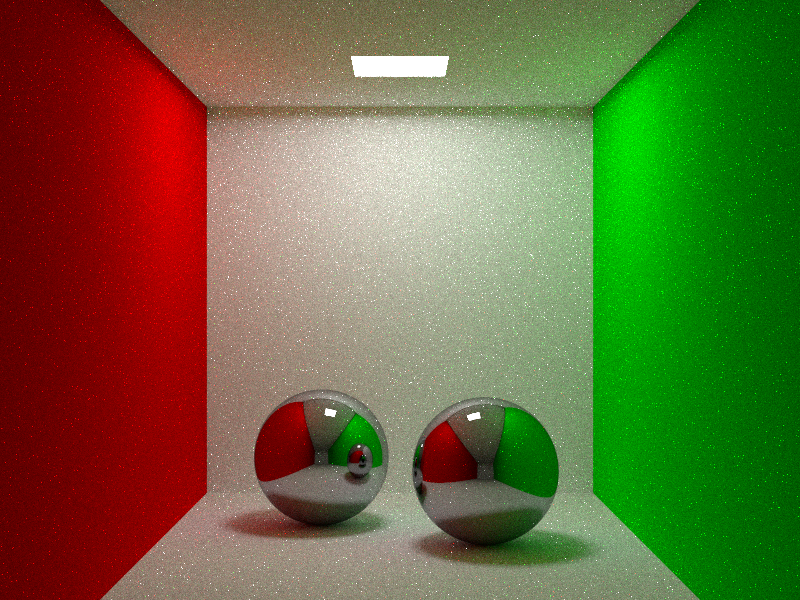
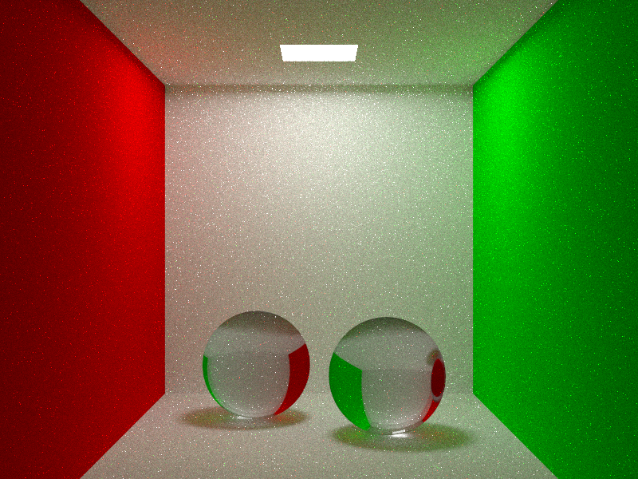

# Path Tracer

A bidirectional path tracer insipired by [Physically Based Rendering: From Theory to Implementation](http://www.pbr-book.org/3ed-2018/contents.html) by Matt Pharr, Wenzel Jakob, and Greg Humphreys.

