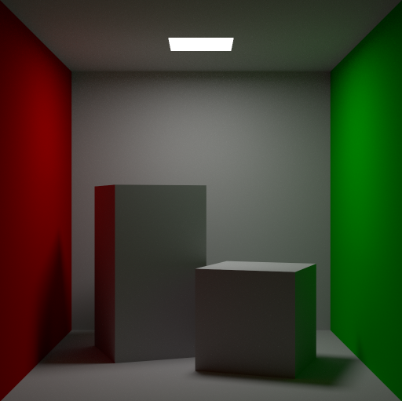
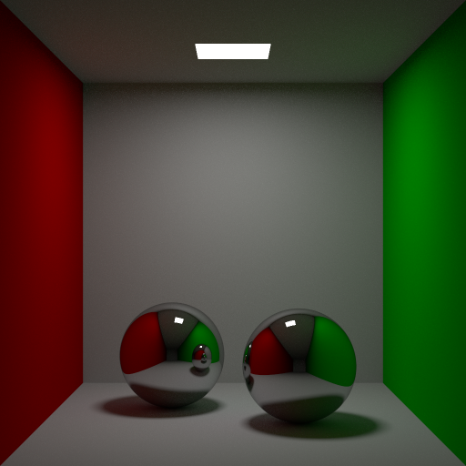
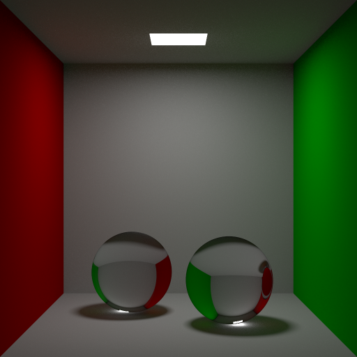

# Path Tracer

A path tracer insipired by [Physically Based Rendering: From Theory to Implementation](http://www.pbr-book.org/3ed-2018/contents.html) by Matt Pharr, Wenzel Jakob, and Greg Humphreys.

Features:
1) Multi-threading;
2) Easy to add new primitives, materials and integrators;
3) Multiple importance sampling for emissive primitives;
4) The picture is rendered sample by sample in the window, therefore no need to wait for render completion during debugging.

Supported primitives:
1) Box;
2) Sphere.

Supported materials:
1) Diffuse;
2) Emissive;
3) Reflective;
4) Transmissive.

## Screenshots

*Diffuse material.*

*Reflective material.*

*Transmissive material.*
